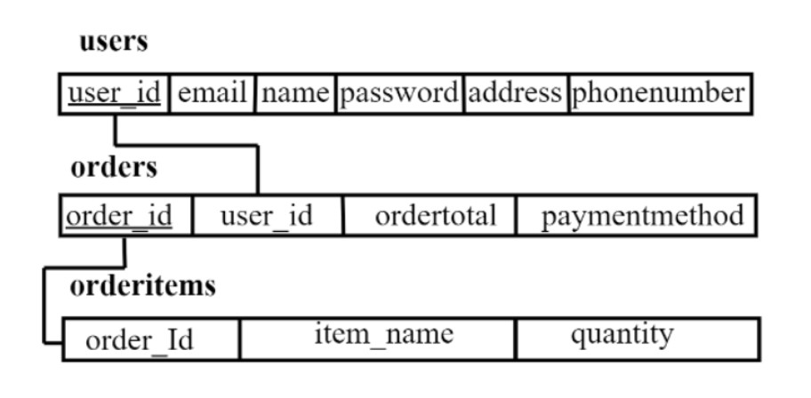

# Online Food Ordering System 

A web-based application for restaurant owners to manage their menu and receive orders from customers.

It has mainly 2 division one is streamlit application and another is userdata.py file which handles all the function related to the sql query.


    
## Run Locally

Clone the project

```bash
  git clone https://github.com/harshit-wadhwani/Online-food-ordering-system.git
```

Go to the project directory

```bash
  cd Online-food-ordering-system
```

create a mysql database named 'onlinerest' and give your password to your user and hosting address in the userdata.py file 
```
db = mysql.connector.connect(
    host='localhost',
    user='root',
    password='',
    database="onlinerest"
)

```
Install dependencies by using the following code 

```
pip install -r requirements.txt
```
[python version 3.8 Recommended]

Start the server

```bash
  streamlit run main.py
```


## Entity Relationship Diagram  



## Author

- [@harshit-wadhwani](https://github.com/harshit-wadhwani)

## 🔗 Links
[](https://www.linkedin.com/in/harshitwadhwani/)
[](https://twitter.com/akadaemonium_)

## Feedback

If you have any feedback, please reach out to us at harshit4work@gmail.com